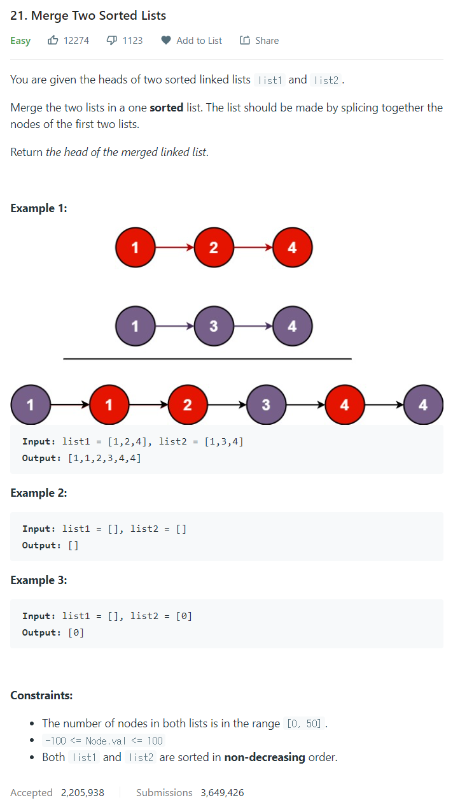

# [21. Merge Two Sorted Lists](https://leetcode.com/problems/merge-two-sorted-lists/)




### My Answer

```python
def mergeTwoLists(self, list1: Optional[ListNode], list2: Optional[ListNode]) -> Optional[ListNode]:
        head1, head2 = list1, list2
        target = ListNode()
        thead = target
        while head1 and head2 : 
            if head1.val < head2.val : 
                thead.next = ListNode(head1.val)
                thead = thead.next
                head1 = head1.next
            else : 
                thead.next = ListNode(head2.val)
                thead = thead.next
                head2 = head2.next
        while head1 : 
            thead.next = ListNode(head1.val)
            thead = thead.next
            head1 = head1.next
        while head2 : 
            thead.next = ListNode(head2.val)
            thead = thead.next
            head2 = head2.next

        return target.next
```

* Time Complexity : O(n)
* Space Complexity : O(n) -> O(1)로 해보기

### The things I got
