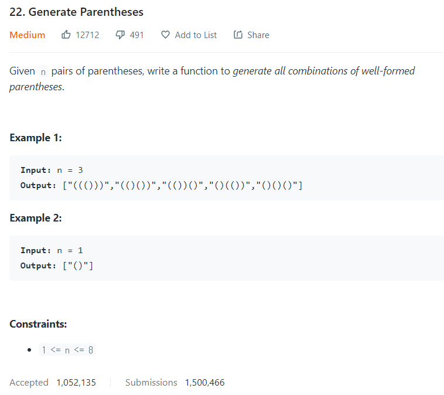

# [22. Generate Parentheses](https://leetcode.com/problems/generate-parentheses/)




### My Answer

```python
def generateParenthesis(self, n: int) -> List[str]:
    parentheses = [["()"]]
    for i in range(2,n+1) : # i is (current n)-1
        n_parenthese = set()
        previous = parentheses[-1]
        for p in previous : 
            n_parenthese.add(p+'()')    
            n_parenthese.add('()'+p)    
            n_parenthese.add('('+p+')')

        for j in range(2,i//2+1) : # j,i-j is combination of parentheses
        	comb1,comb2 = parentheses[j-1], parentheses[i-j-1]
            for x in comb1 : 
            	for y in comb2 : 
                	n_parenthese.add(x+y)
                    n_parenthese.add(y+x)
		parentheses.append(list(n_parenthese))
	return parentheses[-1]
```

* Time Complexity : O(n!..?)
* Space Complexity : O(n)


### The things I got
