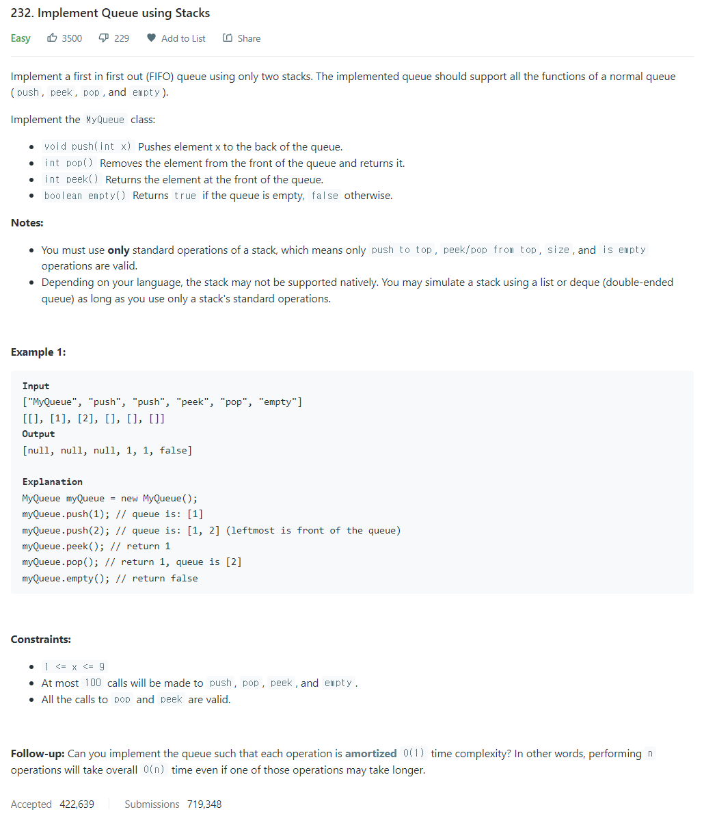

# [232. Implement Queue using Stacks](https://leetcode.com/problems/implement-queue-using-stacks/)




### My Answer

```python
class MyQueue:

    def __init__(self):
        self.stack_in = []
        self.stack_out = []

    def push(self, x: int) -> None:
        self.stack_in.append(x)

    def pop(self) -> int:
        self.peek()
        return self.stack_out.pop()

    def peek(self) -> int:
        if self.stack_out : 
            return self.stack_out[-1]
        else : 
            while self.stack_in : 
                self.stack_out.append(self.stack_in.pop())
            return self.stack_out[-1]

    def empty(self) -> bool:
        return not self.stack_in and not self.stack_out
```

* Time Complexity : O(1)
* Space Complexity : O(n)


### The things I got
