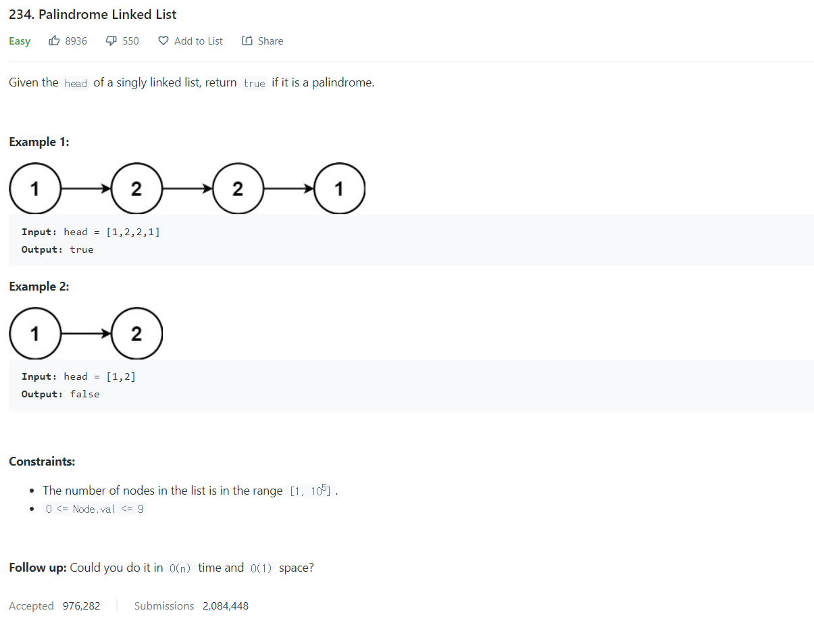

# [234. Palindrome Linked List](https://leetcode.com/problems/palindrome-linked-list/)




### My Answer

```python
def isPalindrome(self, head: Optional[ListNode]) -> bool:
        node=head
        count=0
        while node : 
            node=node.next
            count+=1
        prev=None
        node=head
        for _ in range((count+1)//2) : 
            curr=node
            node=node.next
            curr.next=prev
            prev=curr
            
        left = prev.next if count%2 else prev
        right = node
        
        while left and right : 
            if left.val==right.val : 
                left=left.next
                right=right.next
            else : 
                return False
        if left==None and right==None : 
            return True
        else : 
            return False
        
```

* Time Complexity : O(n)
* Space Complexity : O(1)


### The things I got
