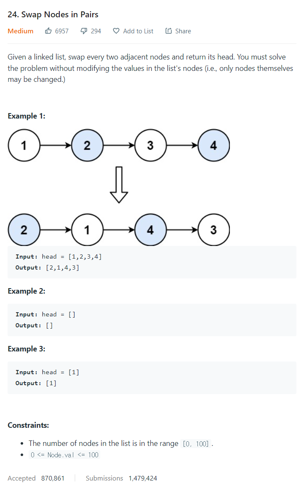

# [24. Swap Nodes in Pairs](https://leetcode.com/problems/swap-nodes-in-pairs/)




### My Answer

```python
def swapPairs(self, head: Optional[ListNode]) -> Optional[ListNode]: 
        h = head
        while h and h.next : 
            h.next.val, h.val = h.val, h.next.val
            h = h.next.next
        return head
```

* Time Complexity : O(n)
* Space Complexity : O(1)


### The things I got
