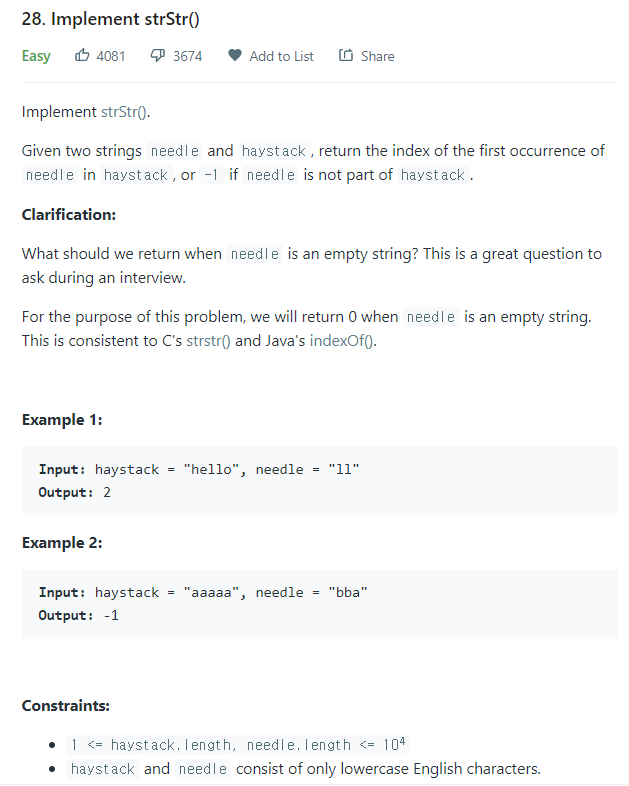

# [28. Implement strStr()](https://leetcode.com/problems/implement-strstr/)




### My Answer

```python
def strStr(self, haystack: str, needle: str) -> int:
	dp=[0]
	prefix=0
	for i in range(1,len(needle)) : 
		while prefix>0 and needle[prefix]!=needle[i] : 
			prefix = dp[prefix-1];
	
		if needle[prefix]==needle[i] : 
			prefix+=1
		dp.append(prefix)
		
	results=[]
	prefix=0
	for i in range(len(haystack)) : 
		while prefix>0 and haystack[i]!=needle[prefix] : 
			prefix=dp[prefix-1]
		if haystack[i] == needle[prefix] : 
			if prefix==len(needle)-1 : 
				return i-len(needle)+1
			else :
				prefix+=1
	return -1
```

* Time Complexity : O(n+m)
* Space Complexity : O(m)


### The things I got
