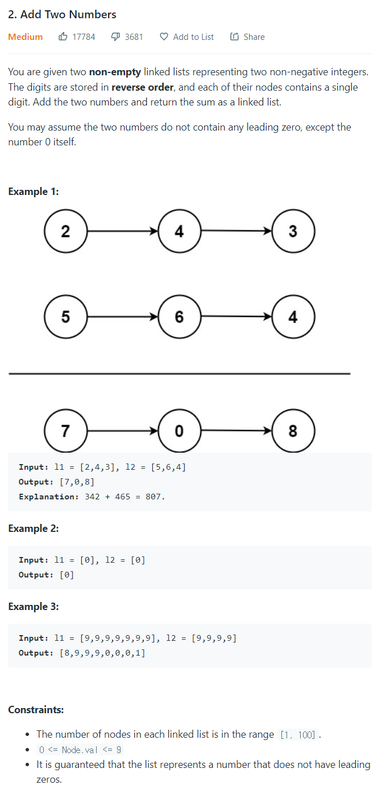

# [2. Add Two Numbers](https://leetcode.com/problems/add-two-numbers/)




### My Answer

```python
def addTwoNumbers(self, l1: Optional[ListNode], l2: Optional[ListNode]) -> Optional[ListNode]:
        
        target = l1
        source = l2
        
        c_in = 0
        while target.next and source.next : 
            sum = target.val + source.val + c_in
            c_in, c_out = sum//10, sum%10
            target.val = c_out
            
            target = target.next
            source = source.next
            
        sum = target.val + source.val + c_in
        c_in, c_out = sum//10, sum%10
        target.val = c_out
        
        if not target.next and not source.next : 
            if c_in : 
                target.next = ListNode(val=1)
            return l1
        
        if source.next : 
            target.next=source.next
            
        target = target.next
        while target.next :
            sum = target.val + c_in
            c_in, c_out = sum//10, sum%10
            target.val = c_out

            target = target.next

        sum = target.val + c_in
        if sum>=10 : 
            target.val = 0
            target.next = ListNode(val=1)
        else : 
            target.val = sum

                
        return l1
```

* Time Complexity : O(n)
* Space Complexity : O(1)


### The things I got
