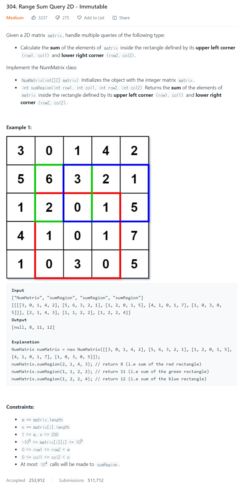

# [304. Range Sum Query 2D - Immutable](https://leetcode.com/problems/range-sum-query-2d-immutable/)




### My Answer

```python
class NumMatrix:

    def __init__(self, matrix: List[List[int]]):
        self.matrix = matrix
        for i in range(len(matrix)-1) : 
            for j in range(len(matrix[0])) : 
                self.matrix[i+1][j]+=self.matrix[i][j]  
        for i in range(len(matrix)) : 
            for j in range(len(matrix[0])-1) : 
                self.matrix[i][j+1]+=self.matrix[i][j]

    def sumRegion(self, row1: int, col1: int, row2: int, col2: int) -> int:
        if row1==0 and col1==0 : 
            return self.matrix[row2][col2]
        elif col1==0 : 
            return self.matrix[row2][col2] - self.matrix[row1-1][col2]
        elif row1==0 : 
            return self.matrix[row2][col2] - self.matrix[row2][col1-1]
        else : 
            return self.matrix[row2][col2] - self.matrix[row2][col1-1] - self.matrix[row1-1][col2] + self.matrix[row1-1][col1-1]
```

* Time Complexity : O(n+m)
* Space Complexity : O(n+m)+O(1)


### The things I got
