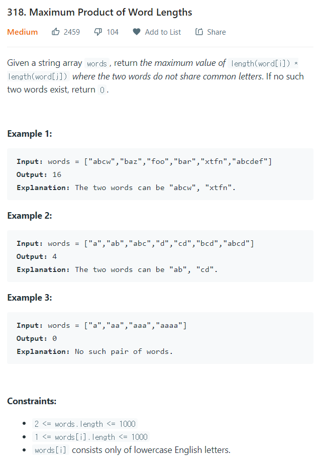

# [318. Maximum Product Of Word Lengths](https://leetcode.com/problems/maximum-product-of-word-lengths/)




### My Answer

```python
def maxProduct(self, words: List[str]) -> int:
        d = {}
        for w in words : 
            unique = set(w)
            mask = 0
            for char in unique : 
                mask |= 1 << ord(char)-97
            d[mask] = max(d.get(mask,0), len(w))
        
        maximum=0
        for x in d : 
            for y in d : 
                if not x&y : 
                    maximum = max(maximum,d[x]*d[y])
        return maximum
```

* Time Complexity : O(n^2)
* Space Complexity : O(n)


### The things I got

비트로 string comparision을 O(1)로 만들어버렸다.... string compare without common word 문제는 이렇게 풀면 될듯  