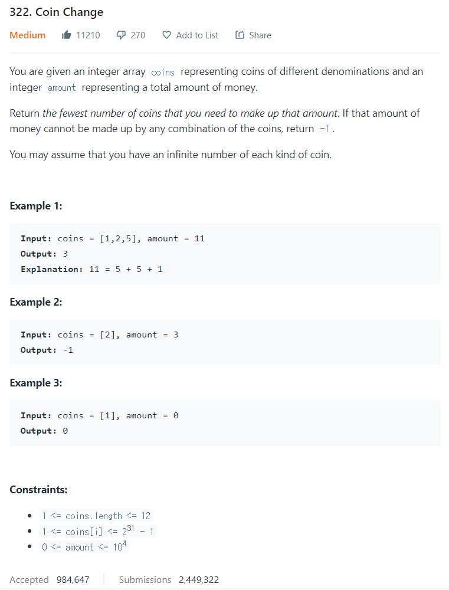

# [322. Coin Change](https://leetcode.com/problems/coin-change/)




### My Answer

```python
def coinChange(self, coins: List[int], amount: int) -> int:
        dp = [amount+1 for _ in range(amount+1)]
        dp[0]=0
        for i in range(len(dp)) : 
            for c in coins : 
                if c <= i : 
                    dp[i] = min(dp[i],dp[i-c]+1)
        
        return dp[-1] if dp[-1]<=amount else -1
```

* Time Complexity : O(amount*c)
* Space Complexity : O(amount+1)


### The things I got
