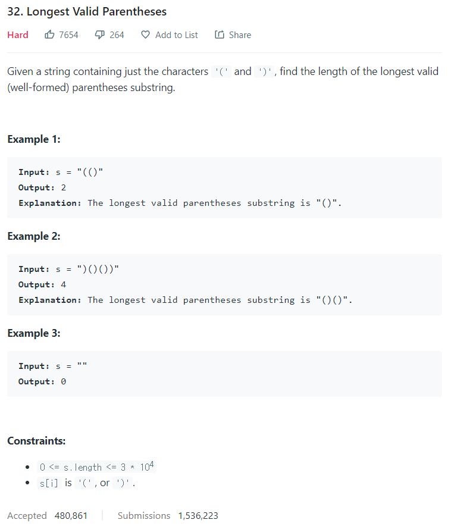

# [32. Longest Valid Parentheses](https://leetcode.com/problems/longest-valid-parentheses/)




### My Answer

```python
class Solution:
    def longestValidParentheses(self, s: str) -> int:
        stack = []
        for i,x in enumerate(s) : 
            if x=='(' :
                stack.append(i)
            else : # x==')'
                if stack : 
                    if s[stack[-1]]=='(' :  #remove middles
                        stack.pop() 
                    else : 
                        stack.append(i)
                else : # empty stack with ')' : useless part
                    stack.append(i)

        max_length = 0
        if len(stack)==0 : 
            max_length = len(s)
        else : 
            l,r = 0,len(s)
            while stack : 
                l = stack.pop()
                if max_length < r-l-1 : 
                    max_length = r-l-1
                r=l
            if max_length < r : 
                max_length = r
        return max_length
                    
```

* Time Complexity : O(2n)
* Space Complexity : O(n)


### The things I got
