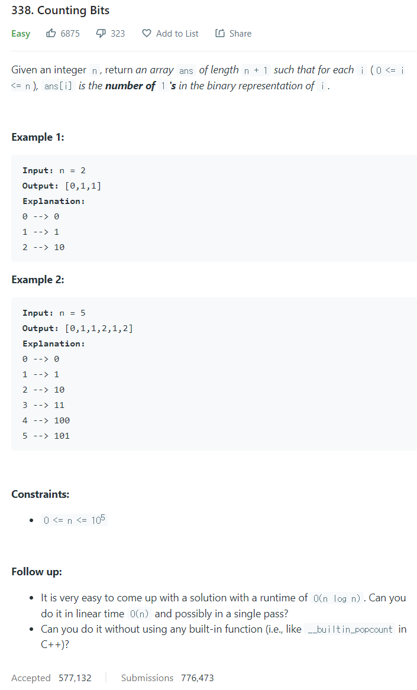

# [338. Counting Bits](https://leetcode.com/problems/counting-bits/)




### My Answer

```python
def countBits(self, n: int) -> List[int]:
    res = [0,1]
    dp = [1]
    while len(dp)<n : 
        dp+=[x+1 for x in dp]
        res+=dp

	return res[:n+1]
```

* Time Complexity : O(n)
* Space Complexity : O(n)


### The things I got
