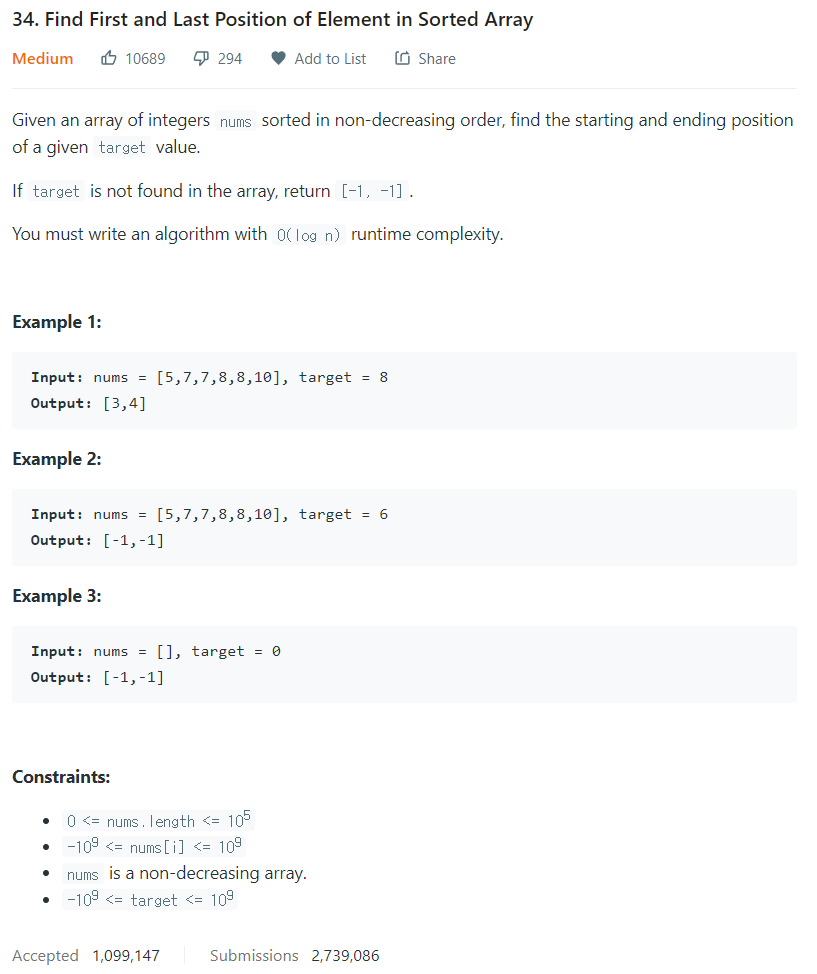

# [34. Find First and Last Position of Element in Sorted Array](https://leetcode.com/problems/find-first-and-last-position-of-element-in-sorted-array/)




### My Answer

```python
    def searchRange(self, nums, target):
        def binarySearchLeft(A, x):
            left, right = 0, len(A) - 1
            while left <= right:
                mid = (left + right) / 2
                if x > A[mid]: left = mid + 1
                else: right = mid - 1
            return left

        def binarySearchRight(A, x):
            left, right = 0, len(A) - 1
            while left <= right:
                mid = (left + right) / 2
                if x >= A[mid]: left = mid + 1
                else: right = mid - 1
            return right
        
    left, right = binarySearchLeft(nums, target), binarySearchRight(nums, target)
    return (left, right) if left <= right else [-1, -1]
        
```

* Time Complexity : O(2log(n))
* Space Complexity : O(1)


### The things I got
