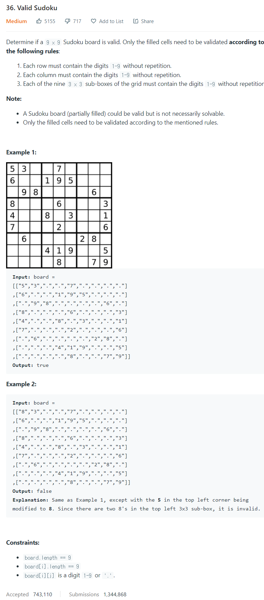

# [36. Valid Sudoku](https://leetcode.com/problems/valid-sudoku/)




### My Answer

```python
def isValidSudoku(self, board: List[List[str]]) -> bool:
        def checkRepeat(target) : 
            S = set()
            for t in target : 
                if t!='.' and t in S  : 
                    return False
                else : 
                    S.add(t)
            return True

        res = all([checkRepeat(x) for x in board]) and all([checkRepeat(x) for x in zip(*board)])
        for i in range(3) : 
            res &= checkRepeat(board[i*3+0][0:3]+board[i*3+1][0:3]+board[i*3+2][0:3])
            res &= checkRepeat(board[i*3+0][3:6]+board[i*3+1][3:6]+board[i*3+2][3:6])
            res &= checkRepeat(board[i*3+0][6:9]+board[i*3+1][6:9]+board[i*3+2][6:9])

        return res
```

* Time Complexity : O(n^2)
* Space Complexity : O(n^2)


### The things I got
