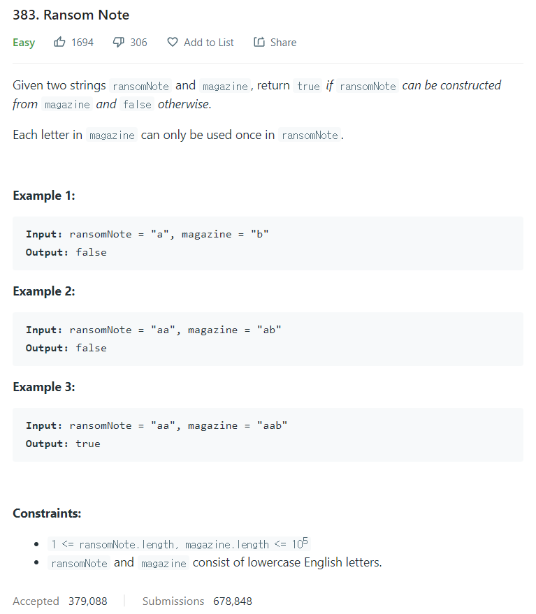

# [383. Ransom Note](https://leetcode.com/problems/ransom-note/)




### My Answer

```python
def canConstruct(self, ransomNote: str, magazine: str) -> bool:
    from collections import Counter

    magazin_count = Counter(magazine)
    ransomNote_count = Counter(ransomNote)

    for x in ransomNote_count : 
        if ransomNote_count[x]>magazin_count[x] : 
            return False

    return True
```

* Time Complexity : O(2n)
* Space Complexity : O(2n)


### The things I got
