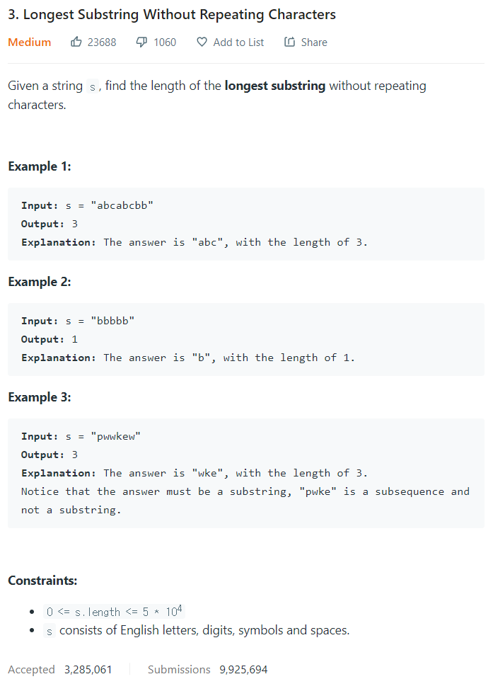

# [3. Longest Substring Without Repeating Characters](https://leetcode.com/problems/longest-substring-without-repeating-characters/)




### My Answer

```python
def lengthOfLongestSubstring(self, s: str) -> int:
        if len(s)==0 : return 0
        l,r=0,0
        m=0
        D = {}
        length = len(s)
        
        while r<length : 
            if s[r] not in D : 
                D[s[r]]=1
                m = max(m,r-l+1)
                r+=1
            else : 
                del D[s[l]]
                l+=1
        return m
```

* Time Complexity : O(n)
* Space Complexity : O(1)~O(n)


### The things I got
