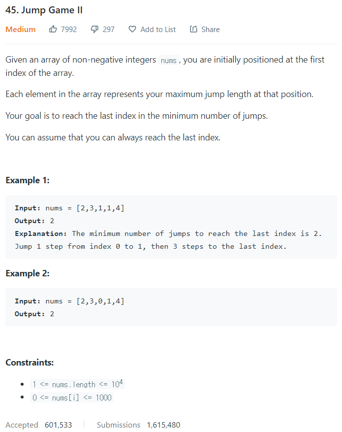

# [45. Jump Game II](https://leetcode.com/problems/jump-game-ii/)




### My Answer

```python
def jump(self, nums: List[int]) -> int:
    count=0
    target=0
    reach=0
    for i in range(len(nums)-1) :
        reach=max(reach-1,nums[i])
        if target==i :
            target=i+reach
            count+=1
	return count
```

* Time Complexity : O(n)
* Space Complexity : O(1)


### The things I got

Brute Force를 찾은 다음 Optimize할 부분을 찾아보자!  