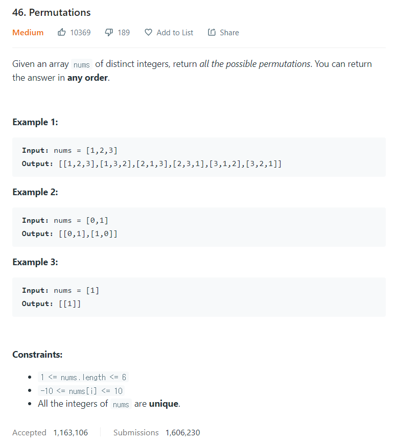

# [46. Permutations](https://leetcode.com/problems/permutations/)




### My Answer

```python
def permute(self, nums):
    perms = [[]]   
    for n in nums:
        new_perms = []
        for perm in perms:
            for i in range(len(perm)+1):
                perm.insert(i,n)
                new_perms.append(perm.copy())
                del perm[i]
            perms = new_perms
return perms
```

* Time Complexity : O(n!)
* Space Complexity : O(n!)


### The things I got
