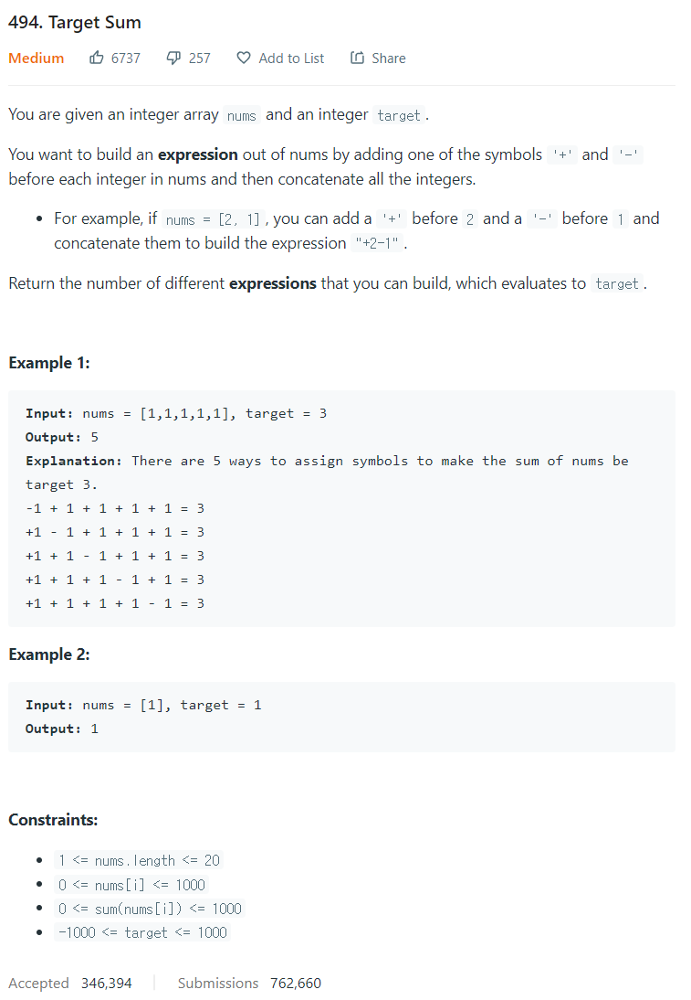

# [494. TargetSum](https://leetcode.com/problems/target-sum/)




### My Answer

```python
class Solution:
    def findTargetSumWays(self, nums: List[int], target: int) -> int:
        dp = [[0 for _ in range(2001)] for _ in range(len(nums))]
        dp[0][1000+nums[0]] += 1
        dp[0][1000-nums[0]] += 1
        for i in range(1,len(nums)) : 
            temp_target = nums[i]
            
            for j in range(len(dp[i])) : 
                if j-temp_target<0 and 2000<j+temp_target : 
                    dp[i][j]+=0
                elif j-temp_target<0 : 
                    dp[i][j]+=dp[i-1][j+temp_target]    
                elif 2000<j+temp_target : 
                    dp[i][j]+=dp[i-1][j-temp_target]
                else : 
                    
                    dp[i][j]+=dp[i-1][j-temp_target]+dp[i-1][j+temp_target]

        return dp[-1][target+1000]
```

* Time Complexity : O(1000*n)
* Space Complexity : O(1000*n)


### The things I got

DP문제 유형을 숙지하도록 하자  

그리고 -를 리스트로 구현하기 힘들면 recursion으로 하자.  