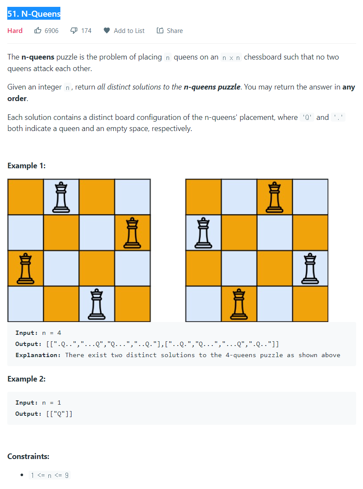

# [1. Two Sum](https://leetcode.com/problems/two-sum/)




### My Answer

```python
class Solution:
    def solveNQueens(self, n: int) -> List[List[str]]:
        def DFS(i,queens,xydif,xysum) : 
            if i==n : return [queens] if len(queens)==n else []
            temp = []
            for j in range(n) : 
                if j not in queens and i-j not in xydif and i+j not in xysum : 
                    temp+=DFS(i+1,queens+[j],xydif+[i-j],xysum+[i+j])
            return temp
            
        queens = DFS(0,[],[],[])
        return [['.'*q+'Q'+'.'*(n-q-1) for q in sol] for sol in queens]
```

* Time Complexity : O(n^n+1)
* Space Complexity : O(n)


### The things I got
