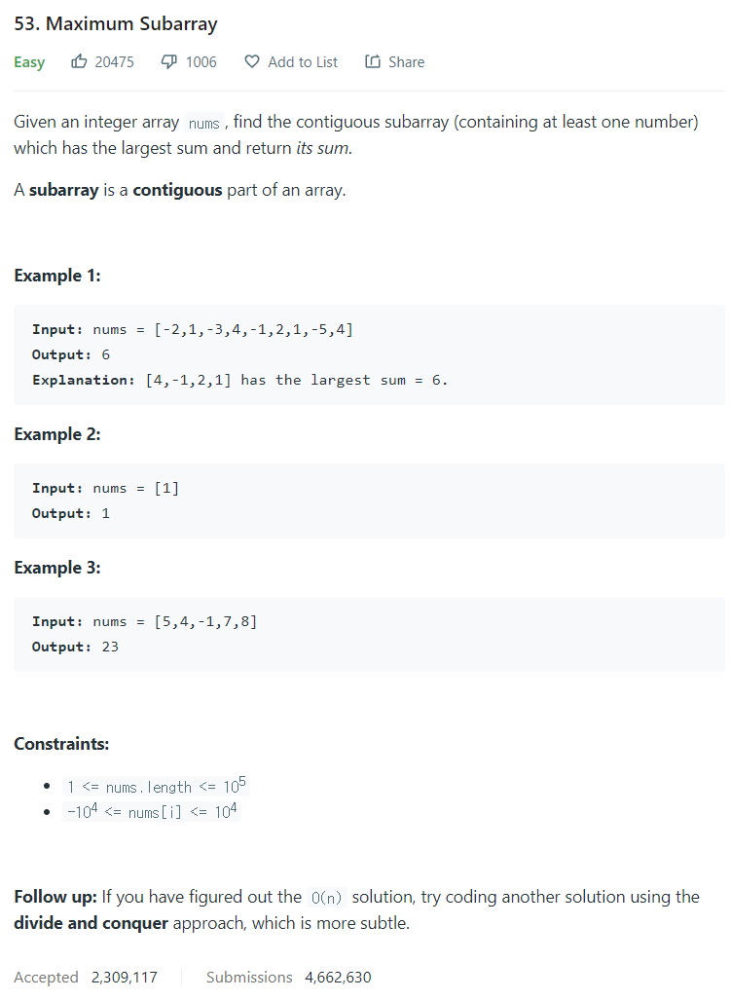

# [53. Maximum Subarray](https://leetcode.com/problems/maximum-subarray/)




### My Answer

```python
def maxSubArray(self, nums: List[int]) -> int:
    last = nums[0]
    minimum = min(0,last)
    max_sum = last

    for i in range(1,len(nums)) : 
        last += nums[i]
        if max_sum < last-minimum : 
            max_sum = last-minimum
            if minimum > last : 
                minimum = last    

	return max_sum
```

* Time Complexity : O(n)
* Space Complexity : O(1)


### The things I got
