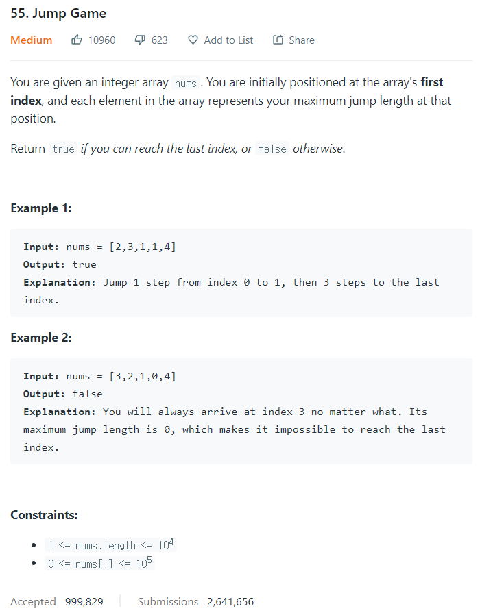

# [55. Jump Game](https://leetcode.com/problems/jump-game/)




### My Answer

```python
def canJump(self, nums: List[int]) -> bool:
    reach=nums[0]
    for i in range(len(nums)) : 
        reach = max(reach-1,nums[i])
        if reach==0 and i!=len(nums)-1 : return False
        elif reach>len(nums)-i : return True
	return True
```

* Time Complexity : O(n)
* Space Complexity : O(1)


### The things I got
