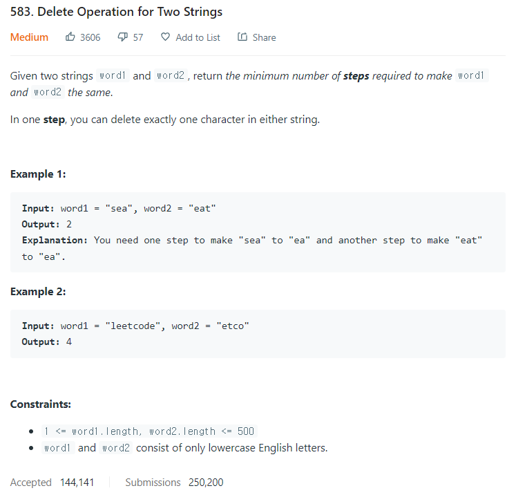

# [583. Delete Operation for Two Strings](https://leetcode.com/problems/delete-operation-for-two-strings/)




### My Answer

```python
class Solution:
    def minDistance(self, word1: str, word2: str) -> int:
        m,n=len(word1),len(word2)
        
        @cache
        def lcs(i, j): 
            if i==m or j==n:
                return 0            
            return 1 + lcs(i+1, j+1) if word1[i]==word2[j] else  max(lcs(i+1, j), lcs(i,j+1))                               
        return m + n - 2*lcs(0,0)
        
```

* Time Complexity : O(m*n)
* Space Complexity : O(m*n)


### The things I got
