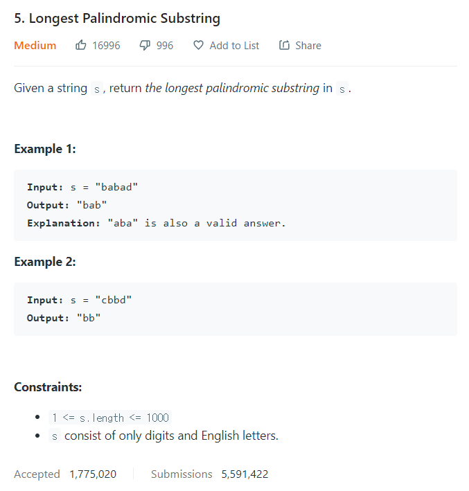

# [5. Longest Palindromic Substring](https://leetcode.com/problems/longest-palindromic-substring/)




### My Answer

```python
class Solution:
    def longestPalindrome(self, s: str) -> str:
        
        if len(s)==1 or len(s)==0: 
            return s
        stack = []
        final_result = ''
        input_s = list(s)
        
        stack.append(input_s[0])
        for i in range(1,len(input_s)) : 
            result = ''
            
            # bbbbb.. case
            if i<len(input_s)-2 and input_s[i]==stack[-1] and input_s[i+1]==stack[-1]:
                middle=''
                temp = stack.copy()
                middle+=input_s[i]+temp.pop()
                j=i+1
                while j<len(input_s) and input_s[j]==input_s[i] : 
                    middle+=input_s[j]  
                    j+=1
                    
                if j<len(input_s) and temp and temp[-1]==input_s[j] : 
                    result += temp.pop()
                    j+=1
                    while temp and j<len(input_s) and input_s[j]==temp[-1] : 
                        result+=temp.pop()
                        j+=1
                    result = result[::-1]+middle+result   
                else : 
                    result = middle
            
            # bab case
            elif i<len(input_s)-1 and input_s[i+1]==stack[-1]:
                middle = input_s[i]
                temp = stack.copy()
                result+=temp.pop()
                j=i+2
                while temp and j<len(input_s) and input_s[j]==temp[-1] : 
                    result+=temp.pop()
                    j+=1
                result = result[::-1]+middle+result
            
            # bb case
            elif input_s[i]==stack[-1] : 
                temp = stack.copy()
                result+=temp.pop()
                j=i+1
                while temp and j<len(input_s) and input_s[j]==temp[-1] : 
                    result+=temp.pop()
                    j+=1
                result = result[::-1]+result
            
            stack.append(input_s[i])
                
            print("input_s[i] : {}, result : {}".format(input_s[i],result))
            if len(final_result) < len(result) : 
                final_result = result
                    
        return final_result if final_result else s[0]
                    
            
            
```

* Time Complexity : O(n) ~ O(n^2)
* Space Complexity : O(2n)


### The things I got
