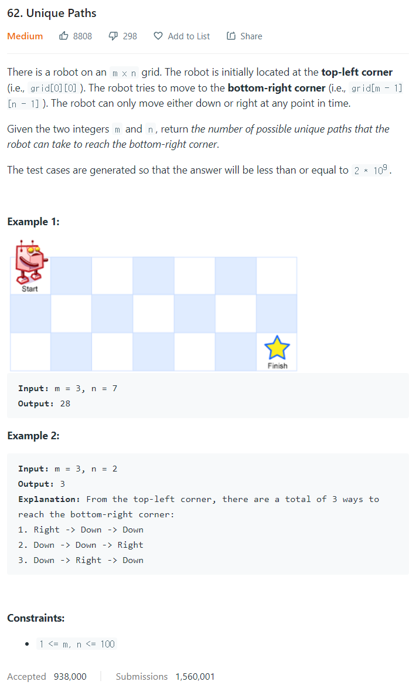

# [62. Unique Paths](https://leetcode.com/problems/unique-paths/)




### My Answer

```python
def uniquePaths(self, m: int, n: int) -> int:
	dp = [[0 for _ in range(n)] for _ in range(m)]
    for i in range(m) : 
    	for j in range(n) : 
        	if i==0 :
            	dp[i][j]=1
            elif j==0 : 
            	dp[i][j]=1
            else : 
            	dp[i][j]=dp[i-1][j]+dp[i][j-1]
	return dp[-1][-1]
```

* Time Complexity : O(m*n)
* Space Complexity : O(m*n)


### The things I got
