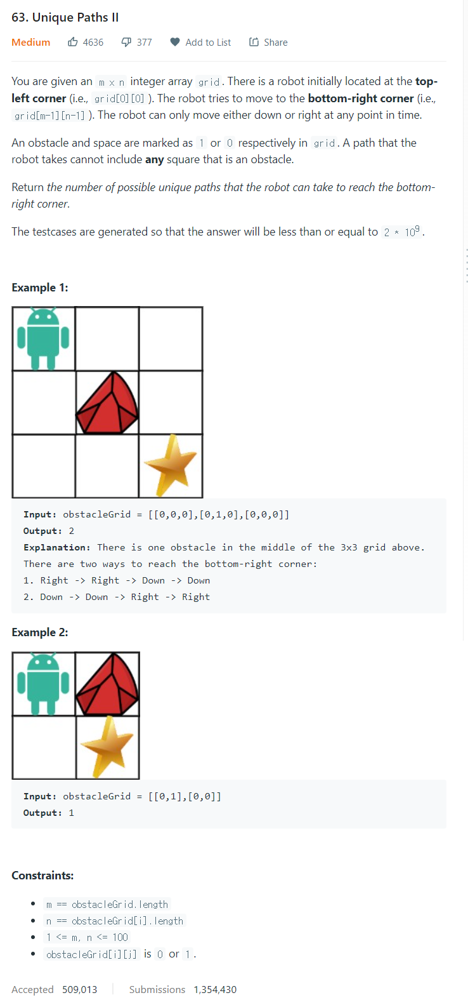

# [63. Unique Paths II](https://leetcode.com/problems/unique-paths-ii/)




### My Answer

```python
def uniquePathsWithObstacles(self, obstacleGrid: List[List[int]]) -> int:
	for i in range(len(obstacleGrid)) : 
    	for j in range(len(obstacleGrid[0])) : 
        	if obstacleGrid[i][j]==1 : 
            	obstacleGrid[i][j]=0
            elif i==0 and j==0 : 
                obstacleGrid[i][j]=1
            elif i==0 and j>0: 
                obstacleGrid[i][j]=obstacleGrid[i][j-1]
            elif i>0 and j==0: 
                obstacleGrid[i][j]=obstacleGrid[i-1][j]
            else : 
                obstacleGrid[i][j]=obstacleGrid[i-1][j]+obstacleGrid[i][j-1]
	return obstacleGrid[-1][-1]
```

* Time Complexity : O(n*m)
* Space Complexity : O(n*m)


### The things I got
