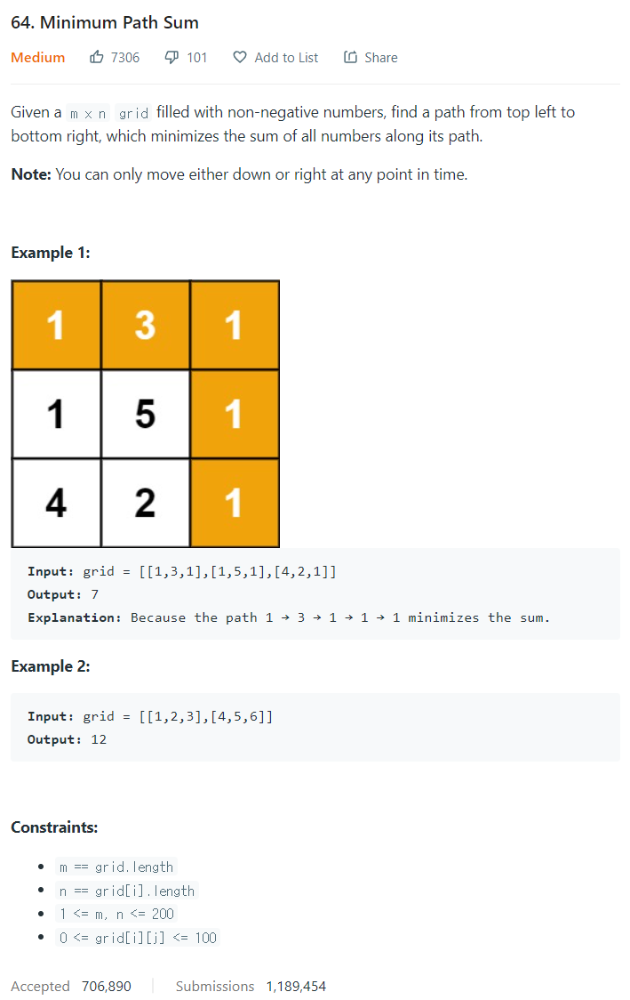

# [64. Minimum Path Sum](https://leetcode.com/problems/minimum-path-sum/)




### My Answer

```python
def minPathSum(self, grid: List[List[int]]) -> int:
    for i in range(1,len(grid)) : 
        grid[i][0]+=grid[i-1][0]
    for j in range(1,len(grid[0])) : 
        grid[0][j]+=grid[0][j-1]

    for i in range(1,len(grid)) : 
    	for j in range(1,len(grid[0])) : 
        	grid[i][j]+=min(grid[i-1][j],grid[i][j-1])

	return grid[-1][-1]
```

* Time Complexity : O(n*m)
* Space Complexity : O(n*m)


### The things I got
