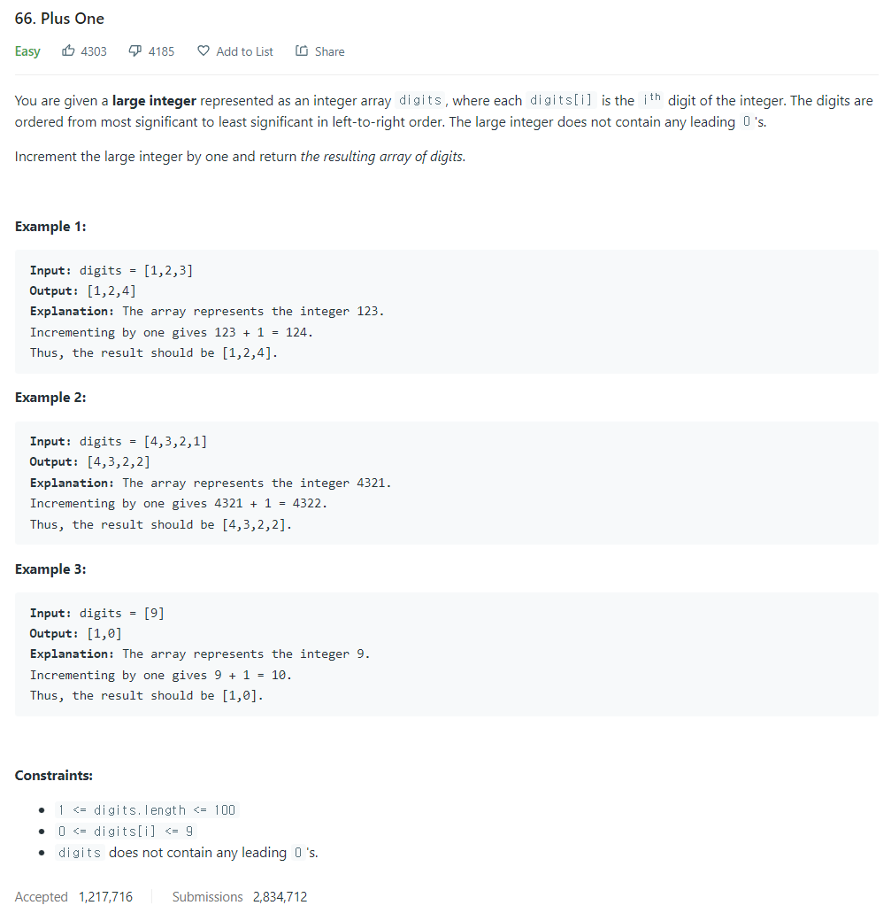

# [66. Plus One](https://leetcode.com/problems/plus-one/)




### My Answer

```python
def plusOne(self, digits: List[int]) -> List[int]:
        i=len(digits)-1
        while 0<=i and digits[i]==9 : 
            digits[i]=0
            i-=1
        if i<0 : 
            digits.insert(0,1)
        else : 
            digits[i]+=1
        return digits
```

* Time Complexity : O(n)
* Space Complexity : O(1)


### The things I got
