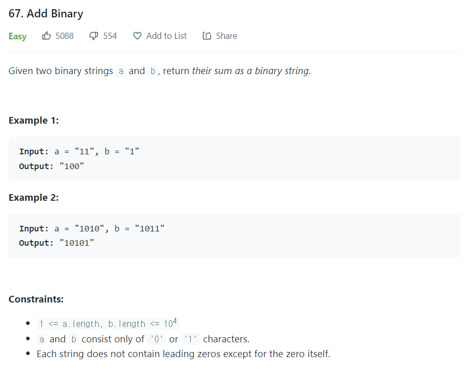

# [1. Two Sum](https://leetcode.com/problems/two-sum/)



### My Answer

```python
class Solution:
    def addBinary(self, a: str, b: str) -> str:
        res=""
        c_in=0
        
        a=list(a)
        b=list(b)
        
        while a or b or c_in : 
            x,y = 0,0
            if a : 
                x = int(a.pop())
            if b : 
                y = int(b.pop())
            s = (x^y)^c_in
            c_out = ((x^y)&c_in) | (x&y)
            c_in = c_out
            res += str(s)
        return res[::-1]
```

* Time Complexity : O(a+b)
* Space Complexity : O(max(a+b))


### The things I got
full adder를 써서 풀었다 (어쩔 수 없는 전자공학도)