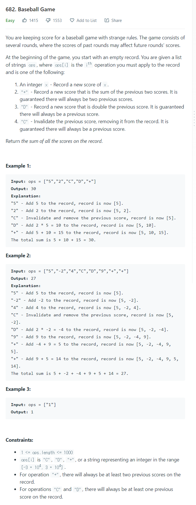

# [682. Baseball Game](https://leetcode.com/problems/baseball-game/)




### My Answer

```python
class Solution:
    def calPoints(self, ops: List[str]) -> int:
        stack = []
        for x in ops : 
            if x.isdigit() or (x[0]=='-' and x[1:].isdigit()): 
                stack.append(int(x))
            elif x=='C' : 
                stack.pop()
            elif x=='D' : 
                previous_score = stack[-1]
                stack.append(previous_score*2)
            elif x=='+' : 
                poped = stack.pop()
                toped = stack[-1]
                plus = poped+toped
                stack.append(poped)
                stack.append(plus)
            else : 
                pass
        return sum(stack)
```

* Time Complexity : O(n)
* Space Complexity : O(n)


### The things I got
