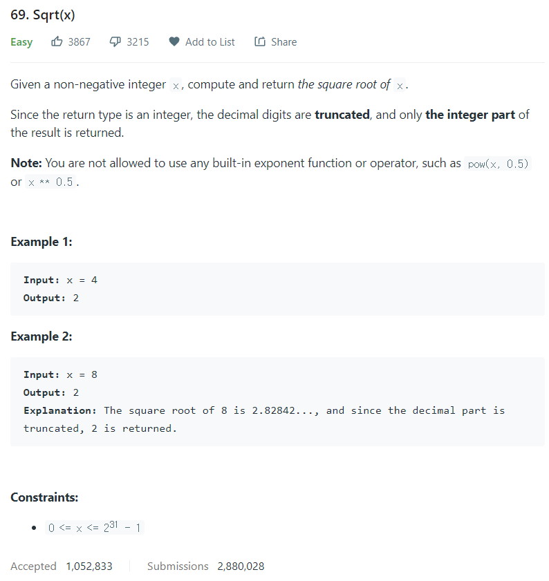

# [69. Sqrt(x)](https://leetcode.com/problems/sqrtx/)




### My Answer

```python
def mySqrt(self, x: int) -> int:
        for i in range(1,x+2) : 
            if i*i>x : 
                return i-1
        return 0
```

* Time Complexity : O(n)
* Space Complexity : O(1)


### The things I got
