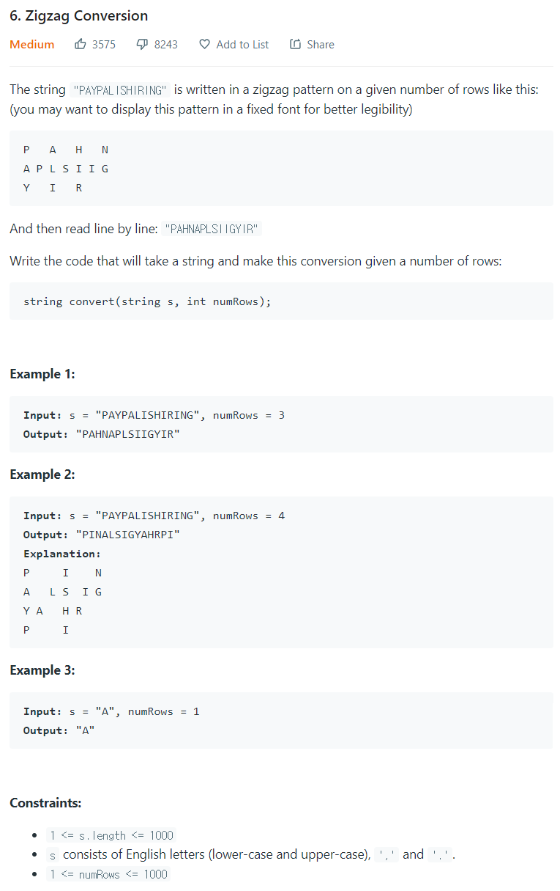

# [6. Zigzag Conversion](https://leetcode.com/problems/zigzag-conversion/)




### My Answer

```python
def convert(self, s: str, numRows: int) -> str:
    rows = ["" for i in range(numRows)]

    seq = (list(range(0,numRows))+list(range(numRows-2,0,-1)))
    seq *= (len(s)//len(seq))+1
    seq_iter = iter(seq)
    for i in range(len(s)) : 
        rows[next(seq_iter)]+=s[i]

    return ''.join(rows)
```

* Time Complexity : O(n)
* Space Complexity : O(2n)


### The things I got

