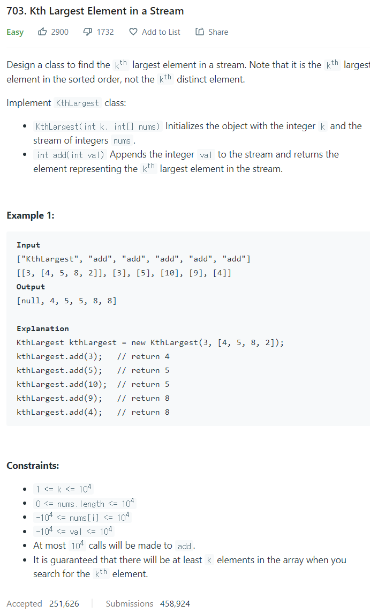

# [703. Kth Largest Element in a Stream](https://leetcode.com/problems/kth-largest-element-in-a-stream/)




### My Answer

```python
def __init__(self, k: int, nums: List[int]):
        self.h = nums
        heapify(self.h)
        while len(self.h) > k : 
            heappop(self.h)
        self.k=k

    def add(self, val: int) -> int:
        if len(self.h) < self.k : 
            heappush(self.h,val)
        elif self.h[0] < val : 
            heapreplace(self.h,val)
        return self.h[0]
```

* Time Complexity : O(n+clog(k)), n=num길이, c=command개수, k=k값
* Space Complexity : O(n)


### The things I got

heap을 사용해서 sort상태 유지를 쉽게하자