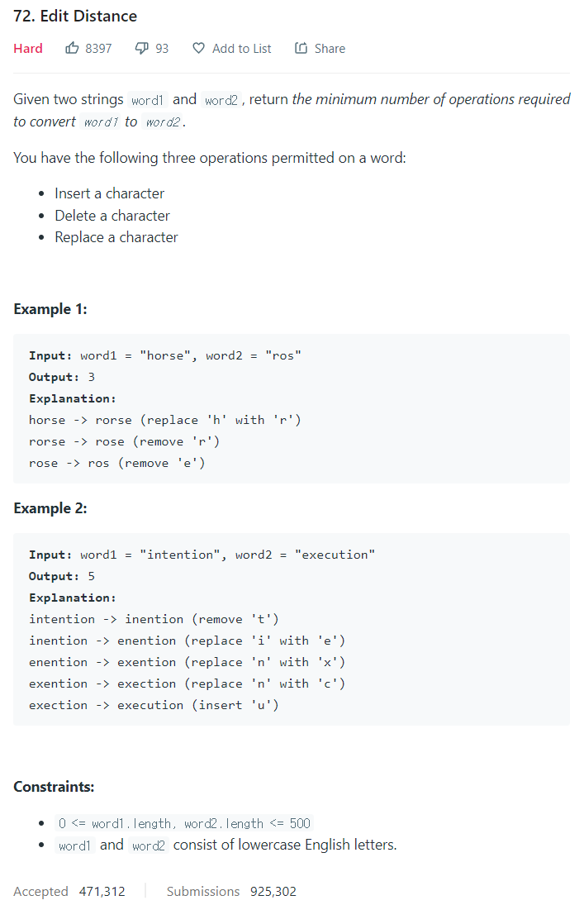

# [72. Edit Distance](https://leetcode.com/problems/edit-distance/)




### My Answer

```python
def minDistance(self, word1: str, word2: str) -> int:
    ed = [[0 if j else i for j in range(len(word2)+1)] if i else [j for j in range(len(word2)+1)] for i in range(len(word1)+1)]

    for i in range(1,len(word1)+1) : 
        for j in range(1,len(word2)+1) : 
            if word1[i-1]==word2[j-1]  : 
                ed[i][j]=ed[i-1][j-1] 
            else : 
            	ed[i][j]=min(ed[i-1][j],ed[i][j-1],ed[i-1][j-1])+1    
	return ed[-1][-1]
```

* Time Complexity : O(n*m)
* Space Complexity : O(n*m)


### The things I got
