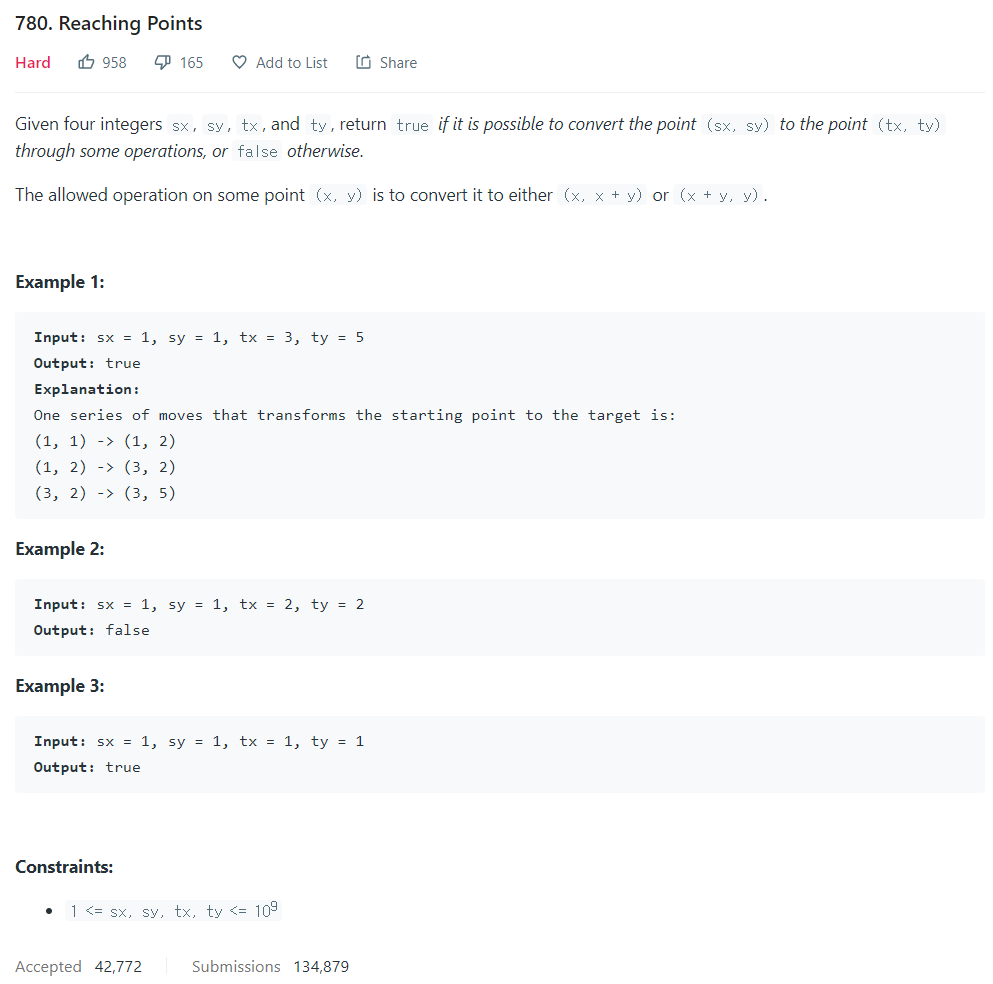

# [1. Two Sum](https://leetcode.com/problems/two-sum/)




### My Answer

```python
def reachingPoints(self, sx: int, sy: int, tx: int, ty: int) -> bool:
	while sx<tx and sy<ty : 
		tx, ty = tx%ty, ty%tx
	return (sx==tx and sy<=ty and ty%tx==sy%tx) or (sy==ty and sx<=tx and tx%ty==sx%ty)
```

* Time Complexity : O(log(min(tx,ty)))
* Space Complexity : O(1)


### The things I got
