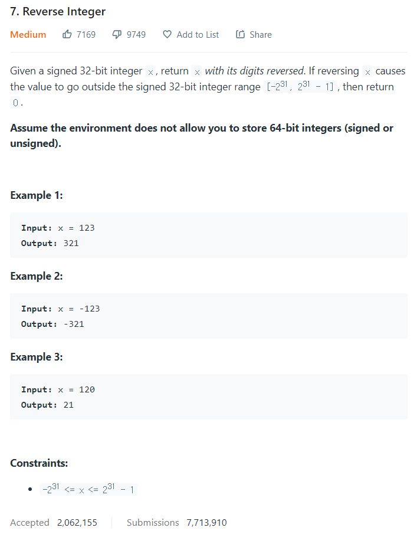

# [7. Reverse Integer](https://leetcode.com/problems/reverse-integer/)




### My Answer

```python
	def reverse(self, x: int) -> int:
        if x<0 :
            x*=-1
            minus=True
        else : 
            minus=False
            
        res=0
        digit=0
        while x//10 and self.is_32bit(res): 
            div,mod = divmod(x,10)
            res=res*10+mod
            x=div
            digit+=1
        res=res*10+x%10
        if minus : res *= -1
        return res if self.is_32bit(res) else 0
        
    
    def is_32bit(self,num) : 
        return -2**31<=num<=2**31-1
```

* Time Complexity : O(logn)
* Space Complexity : O(1)


### The things I got
