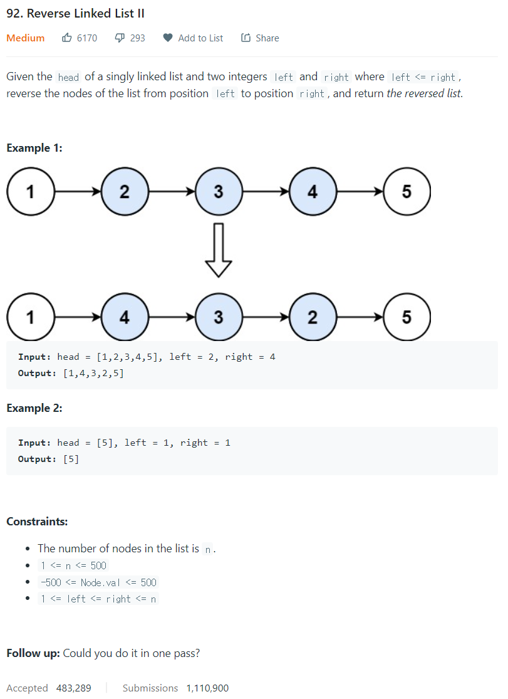

# [92. Reverse Linked List II](https://leetcode.com/problems/reverse-linked-list-ii/)




### My Answer

```python
    def reverseBetween(self, head: Optional[ListNode], left: int, right: int) -> Optional[ListNode]:
        link = ListNode()
        link.next = head
        
        cur, prev = head, link
        for _ in range(left - 1):
            cur = cur.next
            prev = prev.next
        
        for _ in range(right - left):
            node = cur.next
            cur.next = node.next
            node.next = prev.next
            prev.next = node

        return link.next
```

* Time Complexity : O(n)
* Space Complexity : O(1)


### The things I got
