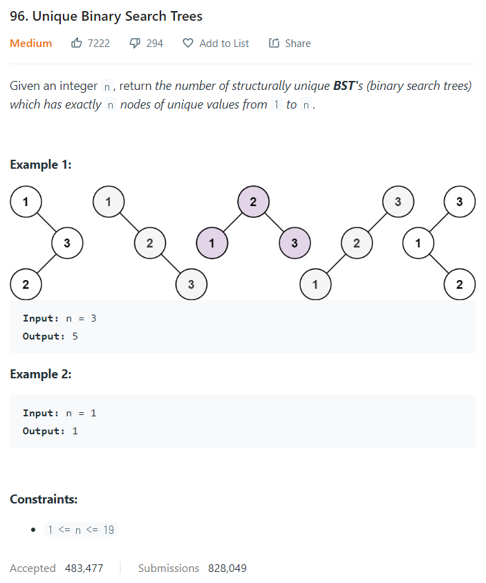

# [96. Unique Binary Search Trees](https://leetcode.com/problems/unique-binary-search-trees/)




### My Answer

```python
def numTrees(self, n: int) -> int:
        dp = [1,1]
        for i in range(2,n+1) : 
            count=0
            for j in range((i+1)//2) : 
                count+=2*dp[i-j-1]*dp[j]    
            if i%2 : #remove repetition
                count-=dp[i//2]**2
            dp.append(count)
        return dp[-1]   
```

* Time Complexity : O(n^2)
* Space Complexity : O(n+1)


### The things I got

어떻게 An에 접근할 수 있을지를 생각하자. 점화식을 세운다기보다는  