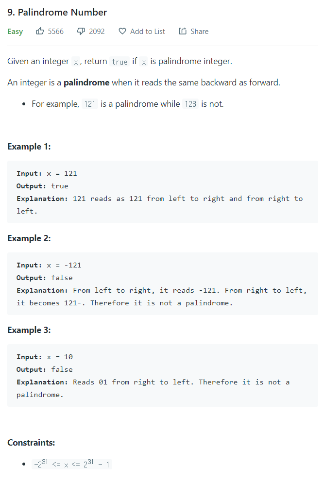

# [9. Palindrome Number](https://leetcode.com/problems/palindrome-number/)




### My Answer

```python
class Solution:
    def isPalindrome(self, x: int) -> bool:
        x_str = str(x)
        l,r = 0,len(x_str)-1
        while l<r and x_str[l]==x_str[r]: 
            l+=1
            r-=1
        return True if l>=r else False
```

* Time Complexity : O(n)
* Space Complexity : O(1)


### The things I got
