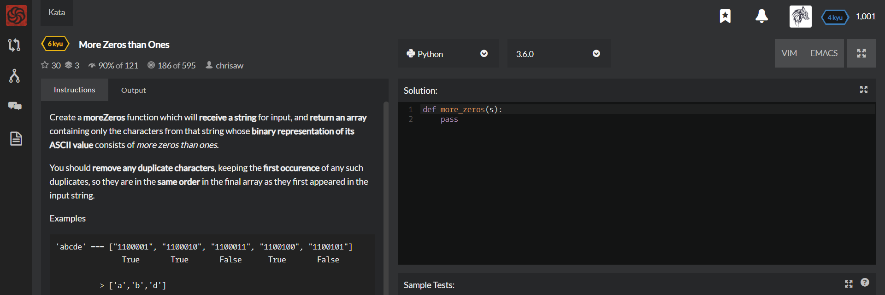

# [[6 Kyu] More Zeros than Ones](https://www.codewars.com/kata/5d41e16d8bad42002208fe1a/train/python)




## Instructions

### Task

Create a **moreZeros** function which will **receive a string** for input, and **return an array** containing only the characters from that string whose **binary representation of its ASCII value** consists of *more zeros than ones*.

You should **remove any duplicate characters**, keeping the **first occurence** of any such duplicates, so they are in the **same order** in the final array as they first appeared in the input string.


### Examples

```python
'abcde' === ["1100001", "1100010", "1100011", "1100100", "1100101"]
               True       True       False      True       False

        --> ['a','b','d']

'DIGEST'--> ['D','I','E','T']
```

All input will be valid strings of length > 0. Leading zeros in binary should not be counted.


## Sample Test

```python
@test.it("Basic tests")
def basic():    
    test.assert_equals(more_zeros('abcde'), ['a', 'b', 'd'])
    test.assert_equals(more_zeros('thequickbrownfoxjumpsoverthelazydog'), ['h', 'b', 'p', 'a', 'd'])
    test.assert_equals(more_zeros('THEQUICKBROWNFOXJUMPSOVERTHELAZYDOG'), ['T', 'H', 'E', 'Q', 'I', 'C', 'B', 'R', 'F', 'X', 'J', 'P', 'L', 'A', 'D'])
    test.assert_equals(more_zeros('abcdefghijklmnopqrstuvwxyzABCDEFGHIJKLMNOPQRSTUVWXYZ1234567890_'), ['a', 'b', 'd', 'h', 'p', 'A', 'B', 'C', 'D', 'E', 'F', 'H', 'I', 'J', 'L', 'P', 'Q', 'R', 'T', 'X', '0'])
    test.assert_equals(more_zeros('DIGEST'), ['D', 'I', 'E', 'T'])
```


## My solution

```python
def more_zeros(s):
    repeat=[]
    output=[]
    
    for x in s : 
        if (bin(ord(x))[2:].count('0')>3) & (x not in repeat) :
            repeat.append(x)
            output.append(x)
            
    return output
```


## Test Results

Test Passed

Test Passed

Test Passed

You have passed all of the tests! :)

---------

Time: 726ms Passed: 27 Failed: 0


## Best Solution

```python
def more_zeros(s):
    results = []
    
    for letter in s:
        dec_repr = bin(ord(letter))[2:]
        if (dec_repr.count("0") > dec_repr.count("1")) and (letter not in results):
            results.append(letter)
    
    return results
```


## The things I got

don't have to set location in double