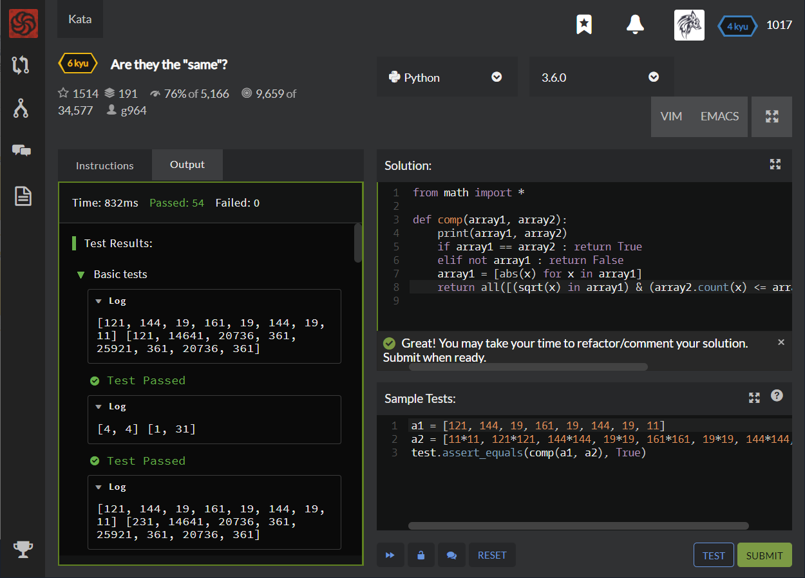

# [[6 Kyu] Are they the "same"?](https://www.codewars.com/kata/550498447451fbbd7600041c/train/python)




## Instructions

### Task

Given two arrays `a` and `b` write a function `comp(a, b)` (`compSame(a, b)` in Clojure) that checks whether the two arrays have the "same" elements, with the same multiplicities. "Same" means, here, that the elements in `b` are the elements in `a` squared, regardless of the order.

#### Remarks

`a` or `b` might be `[]` (all languages except R, Shell). `a` or `b` might be `nil` or `null` or `None` or `nothing` (except in Haskell, Elixir, C++, Rust, R, Shell, PureScript).

If `a` or `b` are `nil` (or `null` or `None`), the problem doesn't make sense so return false.

If `a` or `b` are empty then the result is self-evident.

```racket
a or b are empty or not empty lists.
```

### Examples

#### Valid arrays

```python
a = [121, 144, 19, 161, 19, 144, 19, 11]  
b = [121, 14641, 20736, 361, 25921, 361, 20736, 361]
```

`comp(a, b)` returns true because in `b` 121 is the square of 11, 14641 is the square of 121, 20736 the square of 144, 361 the square of 19, 25921 the square of 161, and so on. It gets obvious if we write `b`'s elements in terms of squares:

```python
a = [121, 144, 19, 161, 19, 144, 19, 11] 
b = [11*11, 121*121, 144*144, 19*19, 161*161, 19*19, 144*144, 19*19]
```

#### Invalid arrays

If we change the first number to something else, `comp` may not return true anymore:

```python
a = [121, 144, 19, 161, 19, 144, 19, 11]  
b = [132, 14641, 20736, 361, 25921, 361, 20736, 361]
```

`comp(a,b)` returns false because in `b` 132 is not the square of any number of `a`.

```python
a = [121, 144, 19, 161, 19, 144, 19, 11]  
b = [121, 14641, 20736, 36100, 25921, 361, 20736, 361]
```

`comp(a,b)` returns false because in `b` 36100 is not the square of any number of `a`.


## Sample Test

```python
a1 = [121, 144, 19, 161, 19, 144, 19, 11]
a2 = [11*11, 121*121, 144*144, 19*19, 161*161, 19*19, 144*144, 19*19]
test.assert_equals(comp(a1, a2), True)
```


## My solution

```python
from math import *

def comp(array1, array2):
    print(array1, array2)
    if array1 == array2 : return True
    elif not array1 : return False
    array1 = [abs(x) for x in array1]
    return all([(sqrt(x) in array1) & (array2.count(x) <= array1.count(sqrt(x))) for x in array2])
	
```


## Test Results

Test Passed

Test Passed

Test Passed

You have passed all of the tests! :)

---------

Time: 832ms Passed: 54 Failed: 0


## Best Solution

```python
def comp(array1, array2):
    try:
        return sorted([i ** 2 for i in array1]) == sorted(array2)
    except:
        return False
```


## The things I got

Read instruction carefully