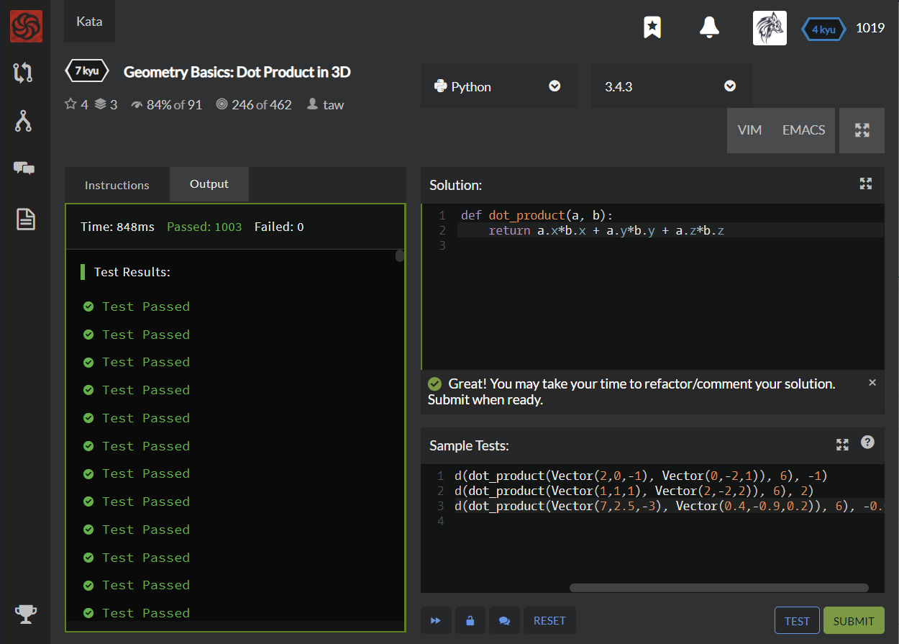

# [[7 Kyu] Geometry Basics: Dot Product in 3D](https://www.codewars.com/kata/58e3ea29a33b52c1dc0000c0/train/python)




## Instructions

### Task

This series of katas will introduce you to basics of doing geometry with computers.

`Vector` objects have `x`, `y`, and `z` attributes.

Write a function calculating dot product of `Vector a` and `Vector b`.

[You can read more about dot product on Wikipedia](https://en.wikipedia.org/wiki/Dot_product).

Tests round answers to 6 decimal places.


## Sample Test

```python
test.assert_equals(round(dot_product(Vector(2,0,-1), Vector(0,-2,1)), 6), -1)
test.assert_equals(round(dot_product(Vector(1,1,1), Vector(2,-2,2)), 6), 2)
test.assert_equals(round(dot_product(Vector(7,2.5,-3), Vector(0.4,-0.9,0.2)), 6), -0.05)

```


## My solution

```python
def dot_product(a, b):
    return a.x*b.x + a.y*b.y + a.z*b.z
```


## Test Results

Test Passed

Test Passed

Test Passed

You have passed all of the tests! :)

---------

Time: 848ms Passed: 1003 Failed: 0


## Best Solution

```python
same
```


## The things I got

