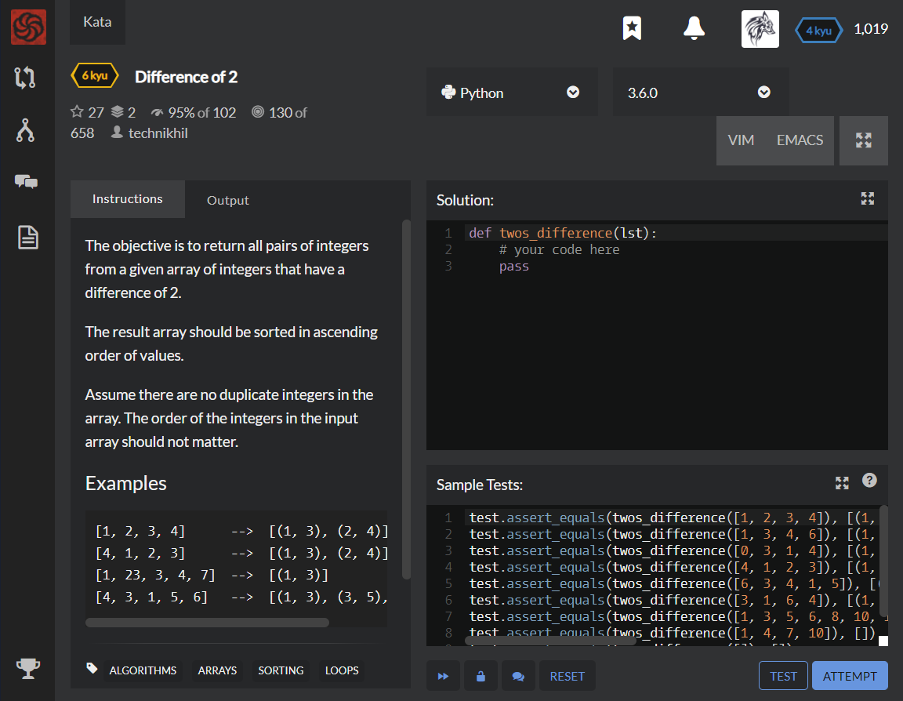

# [[6 Kyu] Difference of 2](https://www.codewars.com/kata/5340298112fa30e786000688/train/python)




## Instructions

The objective is to return all pairs of integers from a given array of integers that have a difference of 2.

The result array should be sorted in ascending order of values.

Assume there are no duplicate integers in the array. The order of the integers in the input array should not matter.

### Examples

```python
[1, 2, 3, 4]      -->  [(1, 3), (2, 4)]
[4, 1, 2, 3]      -->  [(1, 3), (2, 4)]
[1, 23, 3, 4, 7]  -->  [(1, 3)]
[4, 3, 1, 5, 6]   -->  [(1, 3), (3, 5), (4, 6)]
```


## Sample Test

```python
test.assert_equals(twos_difference([1, 2, 3, 4]), [(1, 3), (2, 4)])
test.assert_equals(twos_difference([1, 3, 4, 6]), [(1, 3), (4, 6)])
test.assert_equals(twos_difference([0, 3, 1, 4]), [(1, 3)])
test.assert_equals(twos_difference([4, 1, 2, 3]), [(1, 3), (2, 4)])
test.assert_equals(twos_difference([6, 3, 4, 1, 5]), [(1, 3), (3, 5), (4, 6)])
test.assert_equals(twos_difference([3, 1, 6, 4]), [(1, 3), (4, 6)])
test.assert_equals(twos_difference([1, 3, 5, 6, 8, 10, 15, 32, 12, 14, 56]), [(1, 3), (3, 5), (6, 8), (8, 10), (10, 12), (12, 14)])
test.assert_equals(twos_difference([1, 4, 7, 10]), [])
test.assert_equals(twos_difference([]), [])
```


## My solution

```python
def twos_difference(lst): 
    lst.sort()
    result=[]
    for i in range(len(lst)) : 
        if i==(len(lst)-1) : break
        if lst[i+1]-lst[i]==2 : result.append((lst[i],lst[i+1]))
        if i==(len(lst)-2) : break
        if lst[i+2]-lst[i]==2 : result.append((lst[i],lst[i+2]))
    return result
```


## Test Results

Test Passed

Test Passed

Test Passed

You have passed all of the tests! :)

---------

Time: 1027ms Passed: 109 Failed: 0


## Best Solution

```python
def twos_difference(a):
    s = set(a)
    return sorted((x, x + 2) for x in a if x + 2 in s)
```


## The things I got

