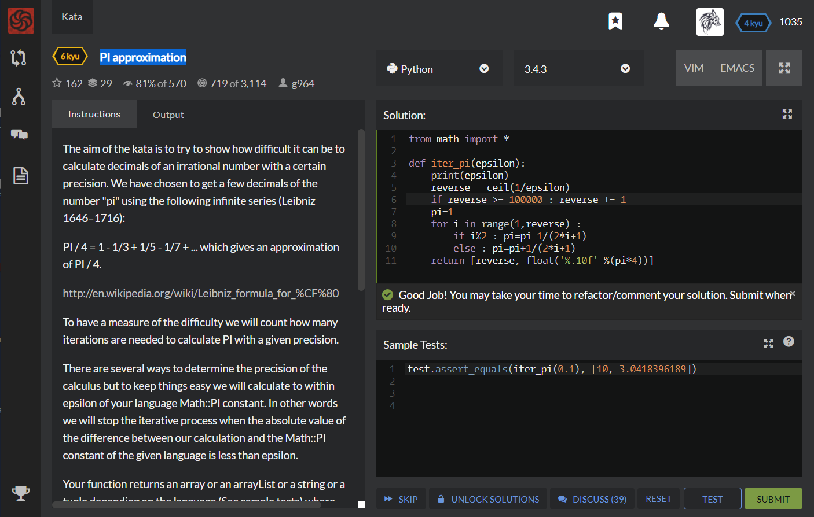

# [[6 Kyu] PI approximation](https://www.codewars.com/kata/550527b108b86f700000073f/train/python)




## Instructions

### Task

The aim of the kata is to try to show how difficult it can be to calculate decimals of an irrational number with a certain precision. We have chosen to get a few decimals of the number "pi" using the following infinite series (Leibniz 1646–1716):

PI / 4 = 1 - 1/3 + 1/5 - 1/7 + ... which gives an approximation of PI / 4.

[http://en.wikipedia.org/wiki/Leibniz_formula_for_%CF%80](http://en.wikipedia.org/wiki/Leibniz_formula_for_π)

To have a measure of the difficulty we will count how many iterations are needed to calculate PI with a given precision.

There are several ways to determine the precision of the calculus but to keep things easy we will calculate to within epsilon of your language Math::PI constant. In other words we will stop the iterative process when the absolute value of the difference between our calculation and the Math::PI constant of the given language is less than epsilon.

Your function returns an array or an arrayList or a string or a tuple depending on the language (See sample tests) where your approximation of PI has 10 decimals

In Haskell you can use the function "trunc10Dble" (see "Your solution"); in Clojure you can use the function "round" (see "Your solution");in OCaml or Rust the function "rnd10" (see "Your solution") in order to avoid discussions about the result.


### Examples

```python
your function calculates 1000 iterations and 3.140592653839794 but returns:
iter_pi(0.001) --> [1000, 3.1405926538]
```


## Sample Test

```python
test.assert_equals(iter_pi(0.1), [10, 3.0418396189])
```


## My solution

```python
from math import *

def iter_pi(epsilon):
    print(epsilon)
    reverse = ceil(1/epsilon)
    if reverse >= 100000 : reverse += 1
    pi=1
    for i in range(1,reverse) :
        if i%2 : pi=pi-1/(2*i+1)
        else : pi=pi+1/(2*i+1)
    return [reverse, float('%.10f' %(pi*4))]
```


## Test Results

Test Passed

Test Passed

Test Passed

You have passed all of the tests! :)

---------

Time: 1330ms Passed: 16 Failed: 0


## Best Solution

```python
from math import pi

def iter_pi(epsilon):
    n = 1
    approx = 4
    while abs(approx - pi) > epsilon:
        n += 1
        approx += (-4, 4)[n % 2] / (n * 2 - 1.0)
    return [n, round(approx, 10)]
```


## The things I got

