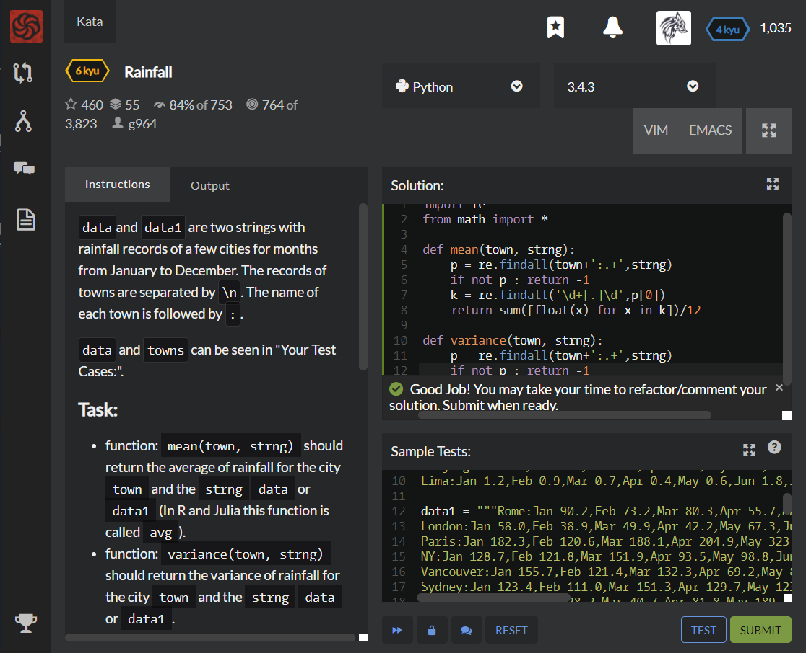

# [[6 Kyu] **Rainfall**](https://www.codewars.com/kata/56a32dd6e4f4748cc3000006/train/python)




## Instructions

`data`and `data1` are two strings with rainfall records of a few cities for months from January to December. The records of towns are separated by `\n`. The name of each town is followed by `:`.

`data` and `towns` can be seen in "Your Test Cases:".

### Task

- function: `mean(town, strng)` should return the average of rainfall for the city `town` and the `strng` `data` or `data1` (In R and Julia this function is called `avg`).
- function: `variance(town, strng)` should return the variance of rainfall for the city `town` and the `strng` `data` or `data1`.


### Examples

```python
mean("London", data), 51.19(9999999999996) 
variance("London", data), 57.42(833333333374)
```

### Notes

- if functions `mean` or `variance` have as parameter `town` a city which has no records return `-1` or `-1.0` (depending on the language)

- Don't truncate or round: the tests will pass if `abs(your_result - test_result) <= 1e-2` or `abs((your_result - test_result) / test_result) <= 1e-6` depending on the language.

- Shell tests only variance

- A ref: http://www.mathsisfun.com/data/standard-deviation.html

- `data` and `data1` (can be named `d0` and `d1` depending on the language; see "Sample Tests:") are adapted from: [http://www.worldclimate.com](http://www.worldclimate.com/)


## Sample Test

```python
data = """Rome:Jan 81.2,Feb 63.2,Mar 70.3,Apr 55.7,May 53.0,Jun 36.4,Jul 17.5,Aug 27.5,Sep 60.9,Oct 117.7,Nov 111.0,Dec 97.9
London:Jan 48.0,Feb 38.9,Mar 39.9,Apr 42.2,May 47.3,Jun 52.1,Jul 59.5,Aug 57.2,Sep 55.4,Oct 62.0,Nov 59.0,Dec 52.9
Paris:Jan 182.3,Feb 120.6,Mar 158.1,Apr 204.9,May 323.1,Jun 300.5,Jul 236.8,Aug 192.9,Sep 66.3,Oct 63.3,Nov 83.2,Dec 154.7
NY:Jan 108.7,Feb 101.8,Mar 131.9,Apr 93.5,May 98.8,Jun 93.6,Jul 102.2,Aug 131.8,Sep 92.0,Oct 82.3,Nov 107.8,Dec 94.2
Vancouver:Jan 145.7,Feb 121.4,Mar 102.3,Apr 69.2,May 55.8,Jun 47.1,Jul 31.3,Aug 37.0,Sep 59.6,Oct 116.3,Nov 154.6,Dec 171.5
Sydney:Jan 103.4,Feb 111.0,Mar 131.3,Apr 129.7,May 123.0,Jun 129.2,Jul 102.8,Aug 80.3,Sep 69.3,Oct 82.6,Nov 81.4,Dec 78.2
Bangkok:Jan 10.6,Feb 28.2,Mar 30.7,Apr 71.8,May 189.4,Jun 151.7,Jul 158.2,Aug 187.0,Sep 319.9,Oct 230.8,Nov 57.3,Dec 9.4
Tokyo:Jan 49.9,Feb 71.5,Mar 106.4,Apr 129.2,May 144.0,Jun 176.0,Jul 135.6,Aug 148.5,Sep 216.4,Oct 194.1,Nov 95.6,Dec 54.4
Beijing:Jan 3.9,Feb 4.7,Mar 8.2,Apr 18.4,May 33.0,Jun 78.1,Jul 224.3,Aug 170.0,Sep 58.4,Oct 18.0,Nov 9.3,Dec 2.7
Lima:Jan 1.2,Feb 0.9,Mar 0.7,Apr 0.4,May 0.6,Jun 1.8,Jul 4.4,Aug 3.1,Sep 3.3,Oct 1.7,Nov 0.5,Dec 0.7"""

data1 = """Rome:Jan 90.2,Feb 73.2,Mar 80.3,Apr 55.7,May 53.0,Jun 36.4,Jul 17.5,Aug 27.5,Sep 60.9,Oct 147.7,Nov 121.0,Dec 97.9
London:Jan 58.0,Feb 38.9,Mar 49.9,Apr 42.2,May 67.3,Jun 52.1,Jul 59.5,Aug 77.2,Sep 55.4,Oct 62.0,Nov 69.0,Dec 52.9
Paris:Jan 182.3,Feb 120.6,Mar 188.1,Apr 204.9,May 323.1,Jun 350.5,Jul 336.8,Aug 192.9,Sep 66.3,Oct 63.3,Nov 83.2,Dec 154.7
NY:Jan 128.7,Feb 121.8,Mar 151.9,Apr 93.5,May 98.8,Jun 93.6,Jul 142.2,Aug 131.8,Sep 92.0,Oct 82.3,Nov 107.8,Dec 94.2
Vancouver:Jan 155.7,Feb 121.4,Mar 132.3,Apr 69.2,May 85.8,Jun 47.1,Jul 31.3,Aug 37.0,Sep 69.6,Oct 116.3,Nov 154.6,Dec 171.5
Sydney:Jan 123.4,Feb 111.0,Mar 151.3,Apr 129.7,May 123.0,Jun 159.2,Jul 102.8,Aug 90.3,Sep 69.3,Oct 82.6,Nov 81.4,Dec 78.2
Bangkok:Jan 20.6,Feb 28.2,Mar 40.7,Apr 81.8,May 189.4,Jun 151.7,Jul 198.2,Aug 197.0,Sep 319.9,Oct 230.8,Nov 57.3,Dec 9.4
Tokyo:Jan 59.9,Feb 81.5,Mar 106.4,Apr 139.2,May 144.0,Jun 186.0,Jul 155.6,Aug 148.5,Sep 216.4,Oct 194.1,Nov 95.6,Dec 54.4
Beijing:Jan 13.9,Feb 14.7,Mar 18.2,Apr 18.4,May 43.0,Jun 88.1,Jul 224.3,Aug 170.0,Sep 58.4,Oct 38.0,Nov 19.3,Dec 2.7
Lima:Jan 11.2,Feb 10.9,Mar 10.7,Apr 10.4,May 10.6,Jun 11.8,Jul 14.4,Aug 13.1,Sep 23.3,Oct 1.7,Nov 0.5,Dec 10.7"""

towns = ["Rome", "London", "Paris", "NY", "Vancouver", "Sydney", "Bangkok", "Tokyo",
         "Beijing", "Lima", "Montevideo", "Caracas", "Madrid", "Berlin"]

from random import shuffle

def assertFuzzyEquals(actual, expected):
    merr = 1e-2
    inrange = abs(actual - expected) <= merr
    msg = ""
    if (inrange == False):
        msg = "abs(actual - expected) must be <= 1e-2. With 10 decimals: Expected was {:.10f} but got {:.10f}"
        msg = msg.format(expected, actual)
        print(msg)
    return Test.expect(inrange, msg)

Test.describe("mean data")
Test.it("Basic tests")
assertFuzzyEquals(mean("London", data), 51.199999999999996) 
assertFuzzyEquals(mean("Beijing", data), 52.416666666666664)

Test.describe("variance data")
Test.it("Basic tests")
assertFuzzyEquals(variance("London", data), 57.42833333333374)
assertFuzzyEquals(variance("Beijing", data), 4808.37138888889)
```


## My solution

```python
import re
from math import *

def mean(town, strng):
    p = re.findall(town+':.+',strng)
    if not p : return -1
    k = re.findall('\d+[.]\d',p[0])
    return sum([float(x) for x in k])/12

def variance(town, strng):
    p = re.findall(town+':.+',strng)
    if not p : return -1
    k = re.findall('\d+[.]\d',p[0])
    rainfall = [float(x) for x in k]
    mean = sum(rainfall)/12
    return sum([abs(x-mean)**2 for x in rainfall])/len(rainfall)
```


## Test Results

Test Passed

Test Passed

Test Passed

You have passed all of the tests! :)

---------

Time: 816ms Passed: 68 Failed: 0


## Best Solution

```python
import statistics, re

rain = lambda town, strng: map(float, re.findall("\d+(?:\.\d+)?", "".join(re.findall(town+":(.+)\n", strng))))

def mean(town, strng):
    return statistics.mean(rain(town, strng))
def variance(town, strng):
    return statistics.pvariance(rain(town, strng))
```


## The things I got

**module statistics** : math statistic methods

* mean() : 산술 평균
* fmean() : 부동 소수점 산술 평균
* median() : 중앙값
* mode() : 최빈값
* pvariance() : 모집단 분산
* pstdev() : 모집단 표준 편차

