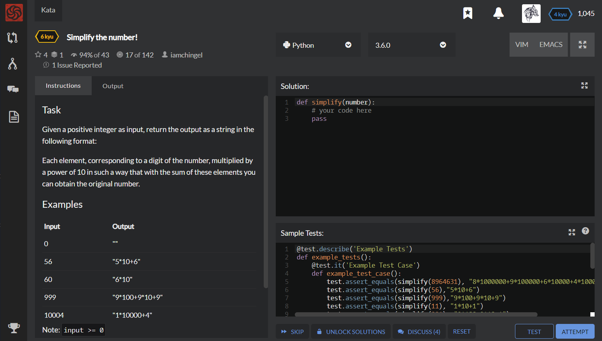

# [[6 Kyu] Simplify the number!](https://www.codewars.com/kata/5800b6568f7ddad2c10000ae/train/python)




## Instructions

### Task

Given a positive integer as input, return the output as a string in the following format:

Each element, corresponding to a digit of the number, multiplied by a power of 10 in such a way that with the sum of these elements you can obtain the original number.

### Examples

```
Input	Output
  0		  ""
 56  	"5*10+6"
 60	    "6*10"
 999	"9*100+9*10+9"
10004	"1*10000+4"
  
Note: input >= 0
```


## Sample Test

```python
@test.describe('Example Tests')
def example_tests():
    @test.it('Example Test Case')
    def example_test_case():
        test.assert_equals(simplify(8964631), "8*1000000+9*100000+6*10000+4*1000+6*100+3*10+1")
        test.assert_equals(simplify(56),"5*10+6")
        test.assert_equals(simplify(999),"9*100+9*10+9")
        test.assert_equals(simplify(11), "1*10+1")
        test.assert_equals(simplify(991), "9*100+9*10+1")
        test.assert_equals(simplify(47), "4*10+7")
        test.assert_equals(simplify(234), "2*100+3*10+4")
        test.assert_equals(simplify(196587), "1*100000+9*10000+6*1000+5*100+8*10+7")
        
    @test.it('Edge Test Case')
    def edge_test_case():
        test.assert_equals(simplify(660), "6*100+6*10")
        test.assert_equals(simplify(600), "6*100")
        test.assert_equals(simplify(9090), "9*1000+9*10")
        test.assert_equals(simplify(10104),"1*10000+1*100+4")
        test.assert_equals(simplify(80008), "8*10000+8")
        test.assert_equals(simplify(90000), "9*10000")
        test.assert_equals(simplify(0), "")
```


## My solution

```python
def simplify(number):
    corresponding = '+'.join([str(x) +'*'+ str(10**i) for i,x in enumerate(str(number)[::-1]) if int(x)][::-1])
    return corresponding[:-2] if number%10 else corresponding
```


## Test Results

Test Passed

Test Passed

Test Passed

You have passed all of the tests! :)

---------

Time: 855ms Passed: 115 Failed: 0


## Best Solution

```python

```


## The things I got

