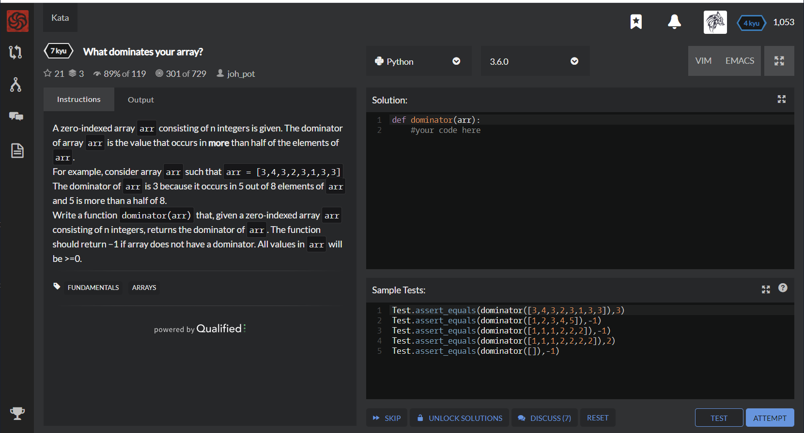

# [[7 Kyu] What dominates your array?](https://www.codewars.com/kata/559e10e2e162b69f750000b4/train/python)




## Instructions

A zero-indexed array `arr` consisting of n integers is given. The dominator of array `arr` is the value that occurs in **more** than half of the elements of `arr`.
For example, consider array `arr` such that `arr = [3,4,3,2,3,1,3,3]`
The dominator of `arr` is 3 because it occurs in 5 out of 8 elements of `arr` and 5 is more than a half of 8.
Write a function `dominator(arr)` that, given a zero-indexed array `arr` consisting of n integers, returns the dominator of `arr`. The function should return −1 if array does not have a dominator. All values in `arr` will be >=0.


## Sample Test

```python
Test.assert_equals(dominator([3,4,3,2,3,1,3,3]),3)
Test.assert_equals(dominator([1,2,3,4,5]),-1)
Test.assert_equals(dominator([1,1,1,2,2,2]),-1)
Test.assert_equals(dominator([1,1,1,2,2,2,2]),2)
Test.assert_equals(dominator([]),-1)
```


## My solution

```python
def dominator(arr):
    return max([x if arr.count(x) > len(arr)/2 else -1 for x in arr+['']])
```


## Test Results

Test Passed

Test Passed

Test Passed

You have passed all of the tests! :)

---------

Time:  Passed:  Failed: 


## Best Solution

```python
from collections import Counter

def dominator(arr):
    if not arr:
        return -1
    k, v = Counter(arr).most_common(1)[0]
    return k if v > len(arr) / 2 else -1
```


## The things I got

**module collections** : [https://hero0926.tistory.com/15](https://hero0926.tistory.com/15)